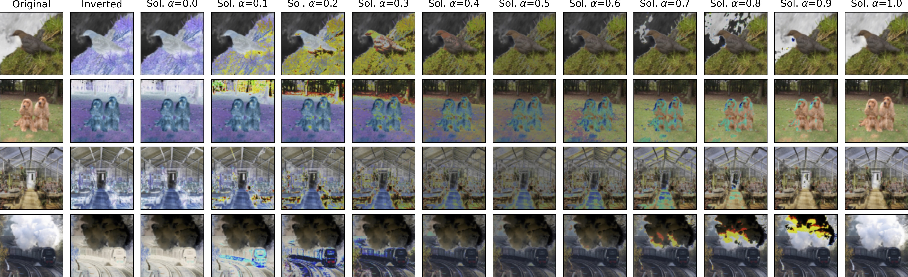

# Don't Look into the Sun: <br> Adversarial Solarization Attacks on Image Classifiers
Paul Gavrikov, Janis Keuper

[![CC BY-SA 4.0][cc-by-sa-shield]][cc-by-sa]

<!-- Presented at: [Conference] -->

<!-- [Paper]() | -->
[ArXiv](https://arxiv.org/abs/2308.12661) 
<!-- Presented at: | [HQ Poster]() | [Talk]() -->


Abstract: *Assessing the robustness of deep neural networks against out-of-distribution inputs is crucial, especially in safety-critical domains like autonomous driving, but also in safety systems where malicious actors can digitally alter inputs to circumvent safety guards. However, designing effective out-of-distribution tests that encompass all possible scenarios while preserving accurate label information is a challenging task. Existing methodologies often entail a compromise between variety and constraint levels for attacks and sometimes even both. In a first step towards a more holistic robustness evaluation of image classification models, we introduce an attack method based on image solarization that is conceptually straightforward yet avoids jeopardizing the global structure of natural images independent of the intensity. Through comprehensive evaluations of multiple ImageNet models, we demonstrate the attack's capacity to degrade accuracy significantly, provided it is not integrated into the training augmentations. Interestingly, even then, no full immunity to accuracy deterioration is achieved. In other settings, the attack can often be simplified into a black-box attack with model-independent parameters. Defenses against other corruptions do not consistently extend to be effective against our specific attack.*


[cc-by-sa]: http://creativecommons.org/licenses/by-sa/4.0/
[cc-by-sa-image]: https://licensebuttons.net/l/by-sa/4.0/88x31.png
[cc-by-sa-shield]: https://img.shields.io/badge/License-CC%20BY--SA%204.0-lightgrey.svg




## Use the attack

We provide code to evaluate our attack (RandSol) against ImageNet models loaded via *timm* (and some others) via PyTorch. Note that you must have ImageNet available on your system. Models must accept inputs in the [0, 1] range with (B, C, W, H) order - the code takes care of this when loading models from predefined sources. If you implement a different model source consider using the `NormalizedModel` class defined in `utils.py`.

```bash
python randsol.py --imagenet <PATH TO IMAGENET> --model resnet50 --target top1 --iterations 10
```
`--target` refers to the attack target and can be `top1` (effective in increasing top-1 error but less on top-5) or `top5` (effective in increasing top-5 error at some reduction in top-1 error).
`--iterations` defines the number of iterations to run per batch. The more iterations the more effective the attack will be at the cost of a longer runtime.
The attack will autoselect the least busy and best device, but you can enforce this, e.g., `--device cuda:0`


This attack can be easily migrated to other datasets, by adding a different dataset loader in `utils.py`.

## Citation 

If you find our work useful in your research, please consider citing:

```
@misc{gavrikov2023dont,
      title={Don't Look into the Sun: Adversarial Solarization Attacks on Image Classifiers}, 
      author={Paul Gavrikov and Janis Keuper},
      year={2023},
      eprint={2308.12661},
      archivePrefix={arXiv},
      primaryClass={cs.CV}
}
```

### Legal
This work is licensed under a
[Creative Commons Attribution-ShareAlike 4.0 International License][cc-by-sa].
